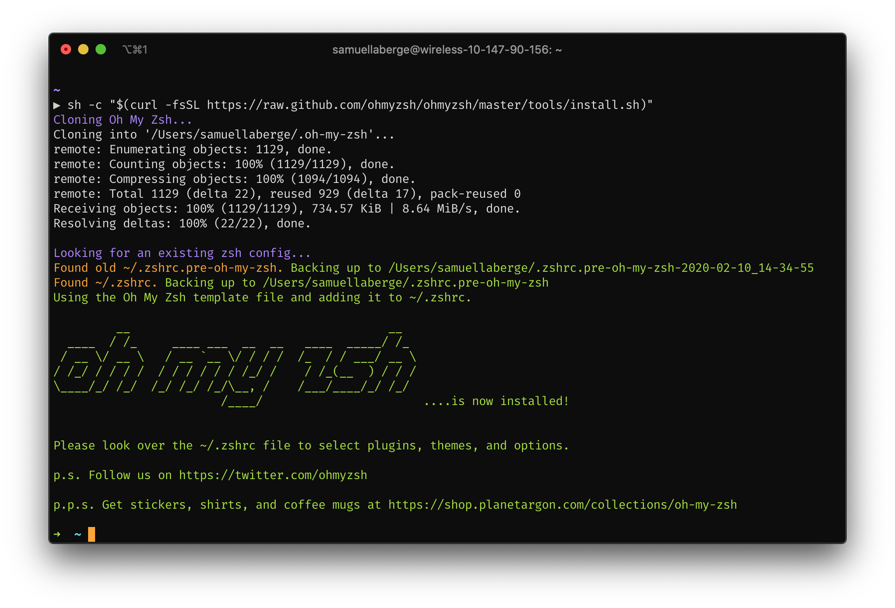
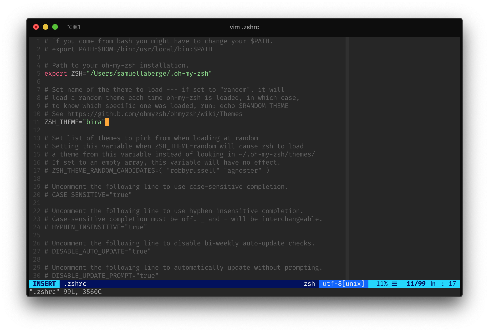

# Advanced SSH Topics

## Automatic Host Finder

In this repo, I've included a Python script which will go to the
available hosts webpage, choose the best host based on number of
users and load, and issue the SSH command for you.

The script is named `UnixHostFinder.py` and it can be run from the command line in the following way:

```bash
python3 UnixHostFinder.py <CS Username>
```

Make sure you are in the same directory as the script before
issuing this command.

To make this even easier, you can assign running this script to an
alias in your shell's rc file.

## A Better Terminal App

The pre-installed Mac terminal would be perfectly sufficient for SSH-ing into the lab machines, but maybe you want something a little fancier.

iTerm2 allows for a lot more customization and features than the default terminal app. I highly recommend it, here's a link:

[iTerm2](https://iterm2.com)

## VSCode SSH Plugin

WIP

## A Better Shell

By default, your Mac and lab machine are probably using the `bash` shell. `bash` is very popular in the Linux/Unix world, but it is also very old. If you would like to have more customization and make your terminal look nicer, I'd recommend the `zsh` because of its easy cutomizability when paired with `ohmyzsh`.

### Switching to zsh

To change the shell on the lab machines, you'll need to [submit a help request](https://www.cs.utexas.edu/faq/68687) to the department for them to change it your shell.

To change the default shell on your Mac, issue the following command:

```bash
chsh -s /bin/zsh
```

(Note: starting with MacOS Catalina, Apple has made the default shell `zsh` instead of `bash`. You may still need to change the shell if you are on Catalina)

### Adding oh-my-zsh

oh-my-zsh is a manager for your zsh installation. It makes it really easy to install packages, change your shell theme, and much more.

To install oh-my-zsh, run the following command:

```bash
sh -c "$(curl -fsSL https://raw.github.com/ohmyzsh/ohmyzsh/master/tools/install.sh)"
```



This will install oh-my-zsh in the `~/.oh-my-zsh` directory. oh-my-zsh will also alter your `.zshrc` file, which is where we can make changes to our shell's configuration.

### Changing the Shell Theme

To get a list of all the themes avaialble to oh-my-zsh, see [this list](https://github.com/ohmyzsh/ohmyzsh/wiki/Themes). Once you've found a theme that you like, you'll just need to remember it's name.

Then, go to the `.zshrc` file in your home directory and change the `ZSH_THEME` variable to your desired theme.



Some themes will require Powerline fonts. You'll know if they do if you start seeing weird characters in your terminal. 

Follow [this guide](https://github.com/powerline/fonts) to install Powerline fonts.
