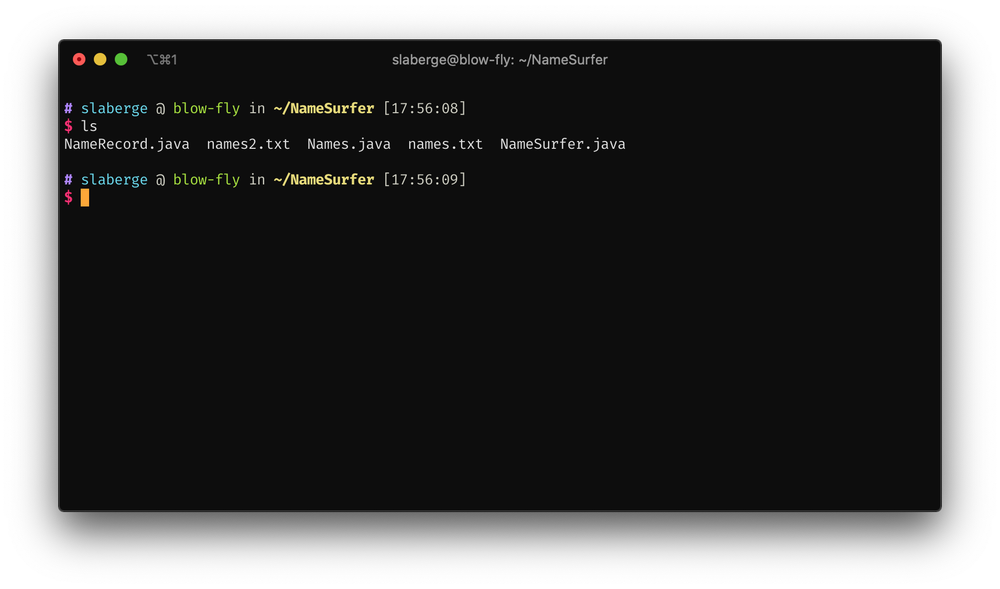
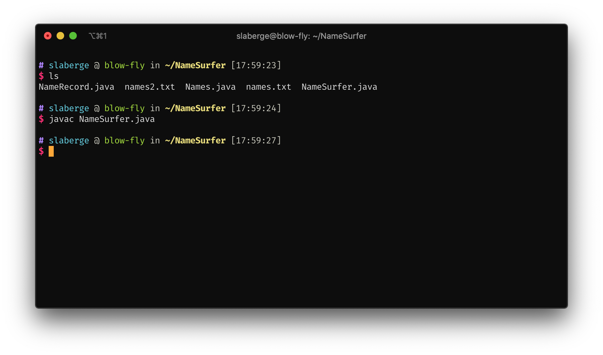
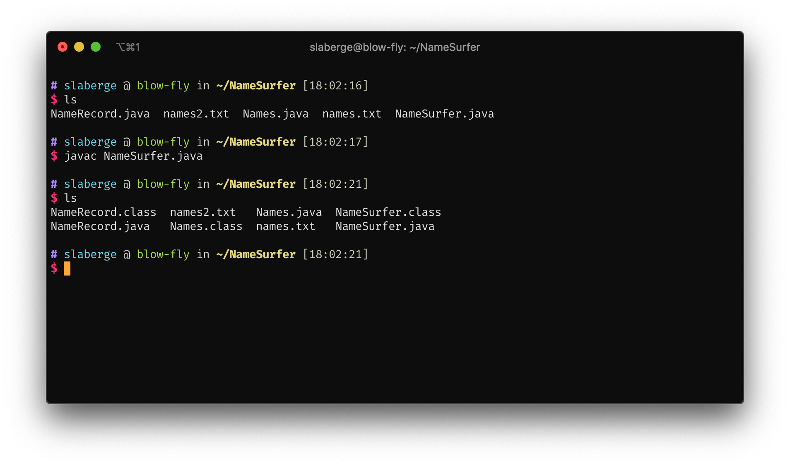
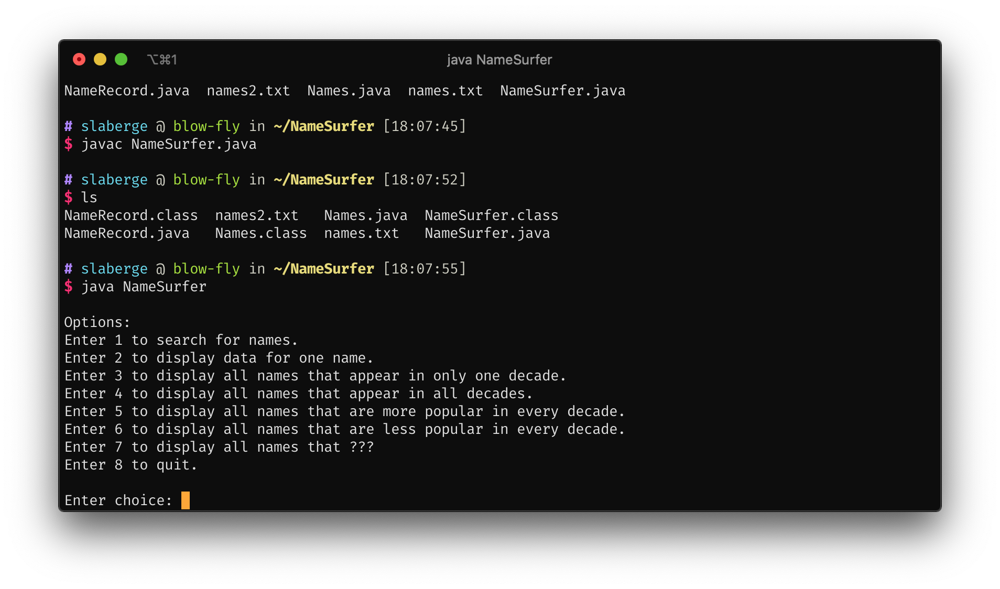

# Running Java Programs on Lab Machines

## Transferring your Program to the Lab Machines

Firstly, transfer all the required `.java` and input files to the lab machines using an SFTP application of your choice. Put all of these files together in the same directory. I'd recommend making a directory just for these files because once we compile your program, it may generate a lot of `.class` files, and we wouldn't want to clutter up another directory.
Navigate to this directory using `cd`.

## Compiling your Program

Once we are in the right directory, issue an `ls` command. You should be able to see all of your `.java` and input files.



Now, make sure you know the name of the class which has your `main` method. For this example, my main method is in the `NameSurfer` class, which is in the `NameSurfer.java` file. So, to compile all of the classes the main method in the `NameSurfer` class will require, run this command:

```bash
javac <main Method Class Name>.java
```

If your code is free of errors and warnings, you shoudln't see any output.



Now, if you issue another ls command, you will be able to see all of the `.class` files as a result of the compilation.



## Running your Java Program

To run your program, you will once again need to know the name of the class which contains your `main` method. In this example, it is once again `NameSurfer`. To run your program with this `main` method, issue the `java` command:

```bash
java <main Method Class Name>
```

_Notice this command's name does not end with a c and you do not include any extensions to the class name_



If everything was successful, you should be running your Java program on a lab machine!

Make sure that your program works as intended in this environment since this is how TAs will be grading your assingments.
