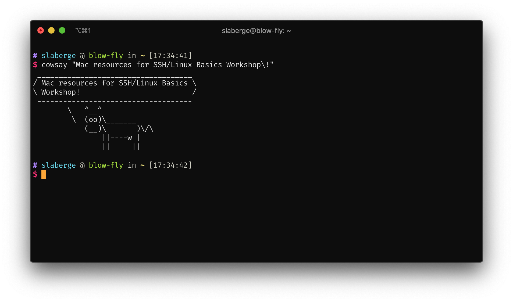

# UTCS SSH Guides and Resources

This repo contains Mac-specific resources for making the best use
of the CS department's lab machines.

If you missed the workshop and don't know where to get started, go through the various guides in this repo in this order:

1. [How to SSH](SSH.md)
2. [Linux Basics](Linux%20Basics.md)
3. [Transferring files with SFTP](SFTP%20Mac%20Apps.md)
4. [Running Java Programs on the Lab Machines](Java.md)
5. [Connecting to the UT VPN](UTVPN.md)
6. [Setting up SSH Keys](SSH%20Keys.md)
7. [More Advanced Topics](Advanced.md)

Workshop Powerpoint: 
https://docs.google.com/presentation/d/12A8KxLDdaIMkX3212vra0NWU70P9pDDigrwBfW_jpx0/edit?usp=sharing
