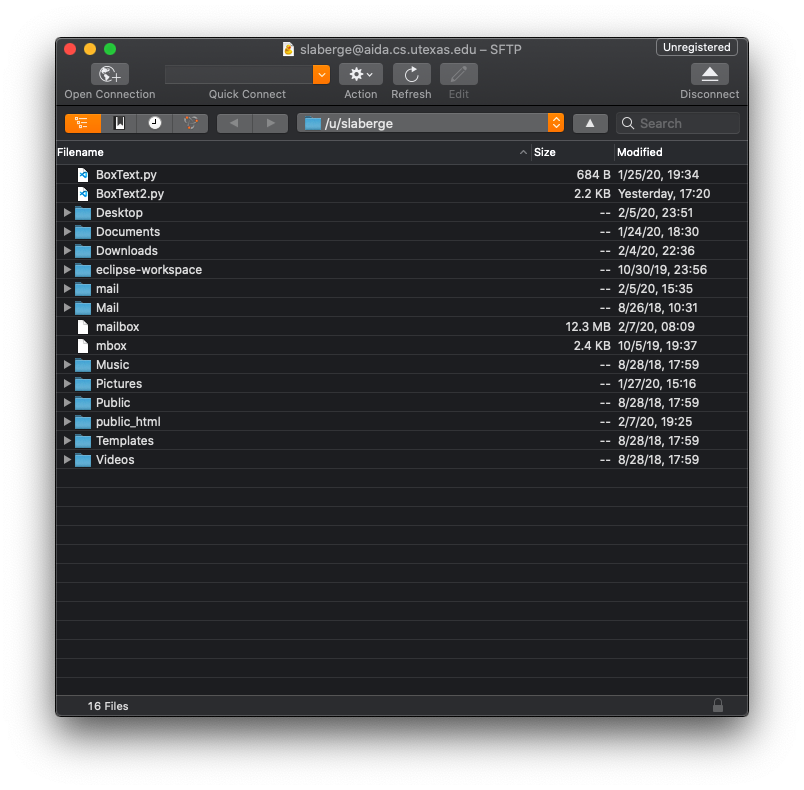

# SFTP Applications for Mac

## CyberDuck (My Recommendation)

[Cyberduck Download (Free version)](https://cyberduck.io/download/)

Mac specific remote file browsing application.

Simpler UI than FileZilla and, in my experience, more intuitive to
use alongside with the Mac's Finder.

Only downside is everytime you quit the app it asks you to donate.
If this drives you insane, then consider using FileZilla (or just donate I guess).

### How to Connect to the Lab Machine with Cyberduck

When you first open Cyberduck, you should see a window similar to the screenshot below.
Press the "Open Connection" button in the top left to start a new SFTP connection.

An open connection menu should pop up. In the drop down, select "SFTP".

Back in the menu, enter the name of a lab machine followed by `.cs.utexas.edu` (like when you were SSHing). Then, enter your CS username and password in their respective fields.

If you are using SSH keys, select your key file from the dropdown. If you used the default key location (like specified in the guide, select `id_rsa`).

## FileZilla

[FileZilla Download](https://filezilla-project.org/download.php?type=client#close)

Cross-platform app available for Windows, Mac, and Linux.

Has a more sophisticated UI and more features than Cyberduck.
