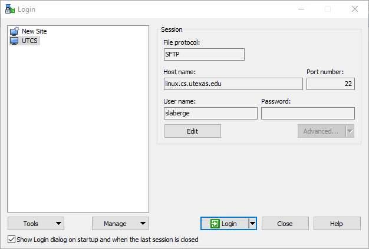
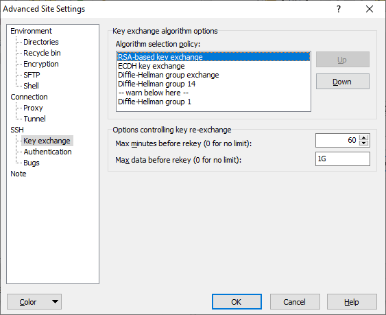
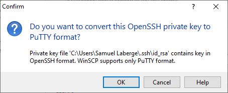

# SFTP Apps for Windows

## WinSCP

This is a free and open-source SFTP client for Windows. It is available for download [here](https://winscp.net/eng/download.php).
(Be careful of the advertisements at the top of the page)

### Using SSH Keys with WinSCP

Make sure you have followed the guide for setting up SSH keys on windows [here](https://www.cs.utexas.edu/facilities-documentation/ssh-keys-cs-windows-10).

Next, open the dialog to create a new connection.

Enter the name of a lab machine (`linux.cs.utexas.edu` works for this purpose) and your CS username. Make sure the File protocol is set to `SFTP`.

Now, enter the `Advanced` menu. Under `SSH > Key Exchange`, move `RSA-based key excahnge` to the top of the `Algorithm Selection Policy` list. This can be done by selecting it and clicking the `Up` button. 

After than, go to `SSH > Authentication`. Here, we have to tell WinSCP where our Private key is located. If you left it in the default location with the default file name, it will be called `id_rsa` and will be in a directory named `.ssh` in your `Users` directory. Select that file or provide the full path to the file.

Then, you may get an error that WinSCP only supports PuTTY style keys. If you are given the option to convert it to a PuTTY key, then do so.

If that option is not presented to you, you can sometimes make WinSCP show it to you by clicking the `Display public key` button. This is the dialog you should see:

Once the key has been converted and selected, you are done in the Advanced settings and you can connect to the lab mahcine. You will then be prompted for the passphrase associated with your key, if you have one.
