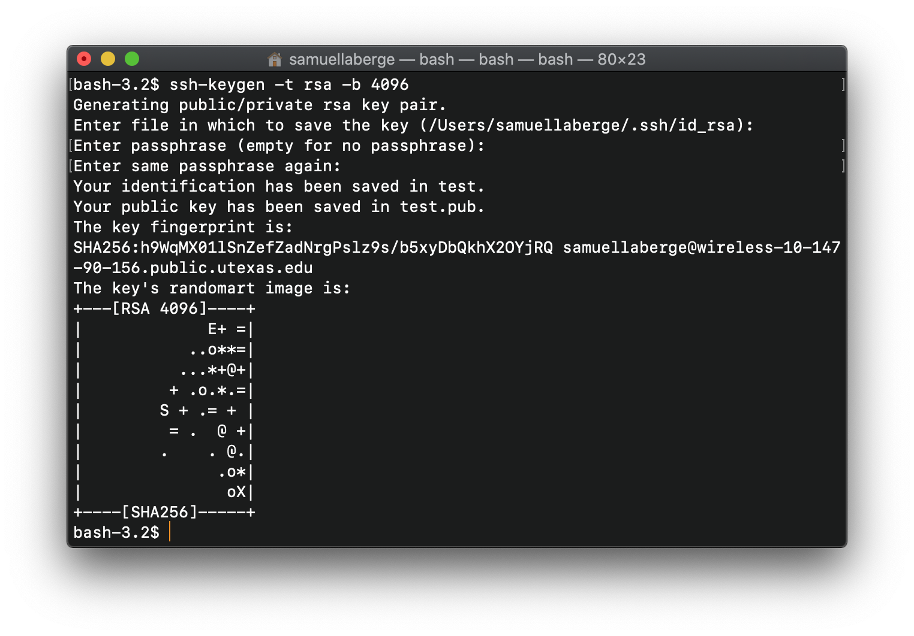

# Setting up SSH Public Keys

To be able to SSH into the lab machines from off-campus, you have two options: use the UT VPN or set up SSH keys on the lab machines. This page will detail the latter, but if you want to learn more about the UT VPN (which is also pretty important, especially if you want to access library documents), you can do so [here](https://ut.service-now.com/sp?id=ut_bs_service_detail&sys_id=86d65c7c4ff9d200f6897bcd0210c781).

This guide is based on UTCS's guide found [here](https://www.cs.utexas.edu/facilities-documentation/ssh-keys-cs-mac-and-linux).
To complete this process, you will need to be on campus or using the UT VPN.

## Creating a Key

First, we need to create a public/private key pair on our local machine. The public key will be sent to the lab machine whereas the private key should remain on your personal computer and never be shared with anyone.

To create a key, run the following command in Terminal:

```bash
ssh-keygen -t rsa -b 4096
```

You will then be prompted to enter a location. It is recommened to use the default location, so just press Enter without entering anything at the prompt.

You will then be prompted to enter a passphrase for this key. The CS Department strongly recommends using a passphrase alongside your keys, although it is not necessary. If you choose to enter a passphrase, you will be prompted to enter it anytime you log into the lab machines from off campus. If you do not want to use a passphrase, press Enter without entering one.

You will then be prompted to confirm your passphrase.

The output should look similar to below.



By default, the public key is stored in a file called `id_rsa.pub` and is located in the hidden directory called `.ssh` in your home directory.

The private key is stored in the same directory but named `id_rsa`. Again, this file should never be moved  off of your computer or shared with anyone.

## Copying Your Public Key to the Lab Machines

To copy your public key to the CS lab machines, run the following command:

```bash
ssh-copy-id <CS Username>@linux.cs.utexas.edu
```

(You can replace `linux.cs.utexas.edu` with any of the other lab machines. Once your key has been copied to one lab machine, it can be used to log in to _any other_ lab machine.)

You will then be prompted for your CS account password (not the passphrase we just created).

If everything was done successfully, you should now be able to log into the lab machines from off-campus!
