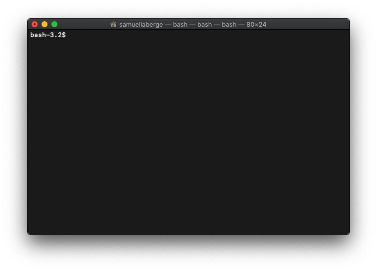
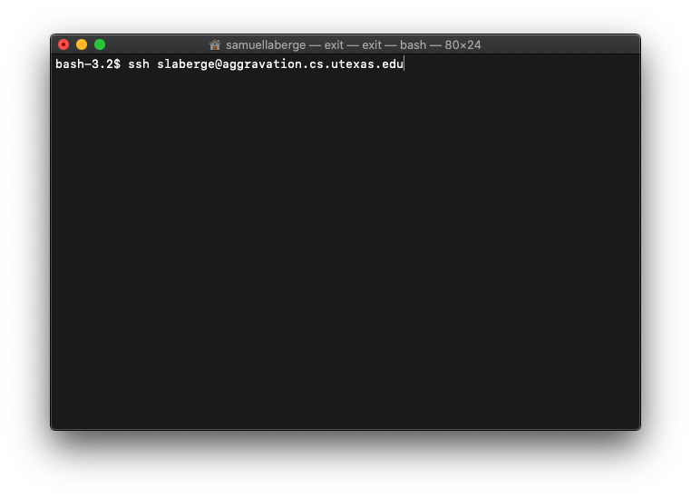
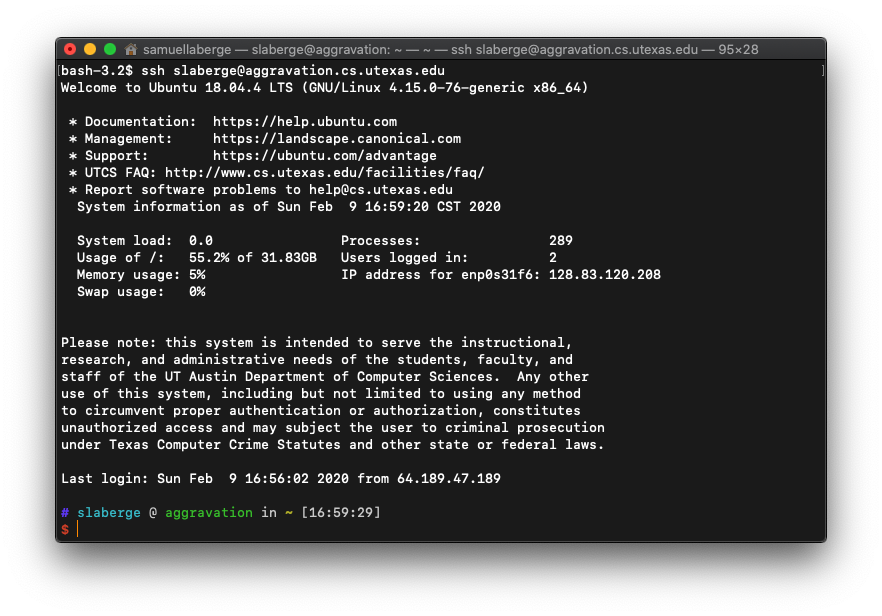

# SSH Tutorial for MacOS

## Pre-reqs

1. Make sure you know your CS account username and password
2. Find an available CS machine to connect to with [this link](https://apps.cs.utexas.edu/unixlabstatus/)
3. If off-campus, make sure to set up SSH keys

## SSH Command

Firstly, open your Mac's terminal. You should be at a shell prompt that looks something like this:



Now, we can issue the SSH command to open a connection with one of the UTCS Lab machines. Here is the format of the command you'll need:

```bash
ssh <CS Username>@<Machine Name>.cs.utexas.edu
```

Fill in the two fields in angle brackets with your username and chosen lab machine. For illustration purposes, I'll use the first lab machine on the website, `aggravation`.



Press enter to issue the command. You may be asked to enter your CS account password. If you do not remember it, use [this link](https://www.cs.utexas.edu/faq/68688). If you set upp SSH keys, you may be asked for your key's passphrase.



The prompt you see will most likely not look like the one above, but if you see the name of the machine you connected to in the prompt, then you successfully connected!

If you got an error, first make sure you entered the command correctly.
You can use the up arrow to fill in the prompt with the previous command in your history.
