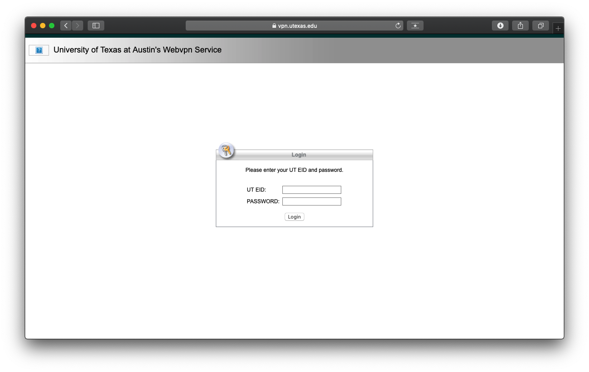
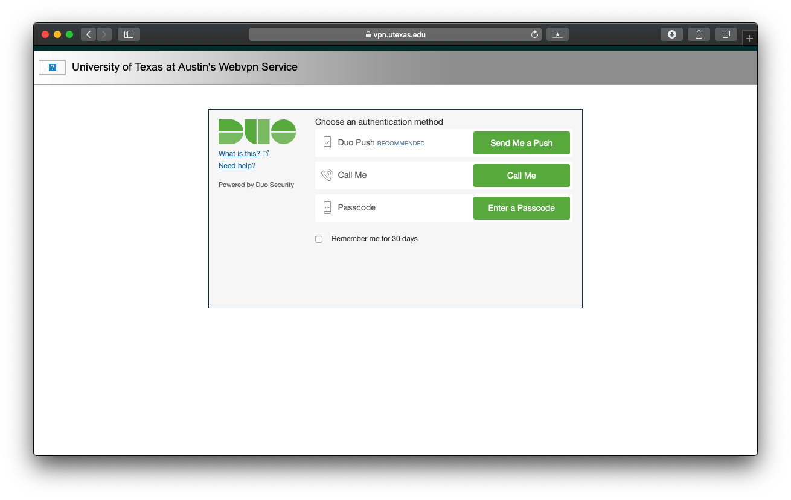
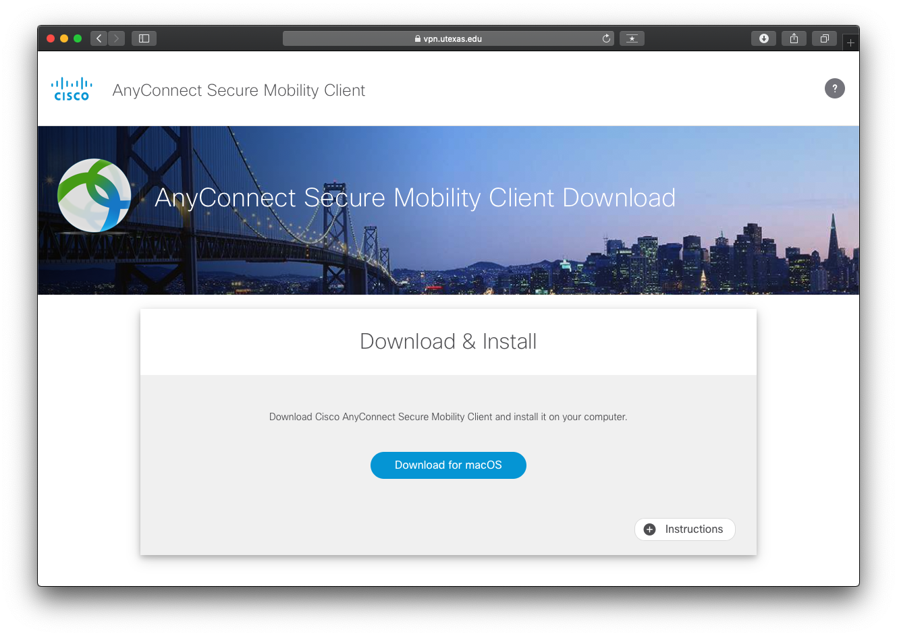
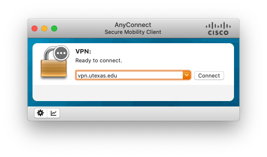
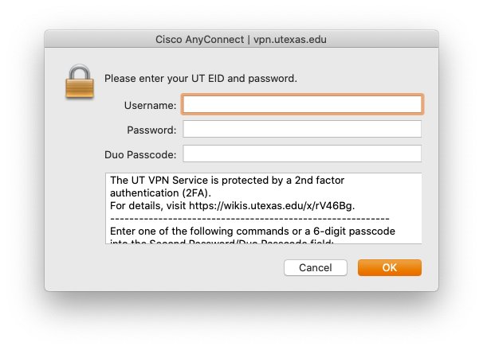

# Connecting to the UT VPN

## Foreword on VPNs

Using the UT VPN will make it appear as though you are connected to UT's on campus internet.  This can be very useful if you are trying to access the UT library, online academic journals, or when trying to connect to the CS machines on campus.

When you connect to a VPN, all of your Internet traffic will be routed through that VPN service. This is true of all VPN services, including UT's. Although I doubt UT has any nefarious intents, realize that VPN services could get a lot of information on you based on your internet activity.

**Therefore, as a general security principle, only use a VPN when you absolutely have to.** In the case of UT's VPN, you should only use it while you are connected to a CS machine, trying to access library documents, etc. Disconnect from the VPN after you are done.

In the case of the CS lab machines, you could technically never set up your [SSH keys](SSH%20Keys.md) and only use the VPN.
However, this would likely be slower and violates the above principle.
Instead, only use the VPN to set up your SSH keys, and then you will not have to connect to the VPN afterwards to connect to the lab machines.

## Prerequisites

1. Make sure you have DUO two-factor authentication set up. You can do this by following [this guide](https://wikis.utexas.edu/display/comm/Duo+-+Two+Factor+-++Authentication+-+Mobile+Phone+-+How+to+Authenticate+Your+Cell+Phone).

## Setting up the VPN

Visit [vpn.utexas.edu](https://vpn.utexas.edu/) and log in using your UT EID.

It will then ask you to authenticate using DUO. Choose an authentication method to proceed.

If you are on Mac, you will then need to install a piece of software by Cisco which will set up the VPN on your device.

Click on the "Instructions" button if you would like instructions on how to install the software.

## Getting Connected

Once you are finished installing, open the "Cisco AnyConnect Secure Mobility Client". You should see the following window.

Type `vpn.utexas.edu` in the field and click connect.

You will then be shown an authentication window. 

In the Username field, enter your UT EID. 

In the Password field enter the password associated with your UT EID. 

In the last field, Duo passcode, you can enter any of the following options:

1. `push` - This will send a push notification to your authorized DUO device.
2. `sms` - This will send an SMS message to your DUO-authorized phone number.
3. `phone` - This will call your DUO-authorized phone number.

Click Ok and then, with your selected authentication method, provide two-factor authentication to connect.

If everything was successful, you should see a message indicating you successfully connected to the VPN!

